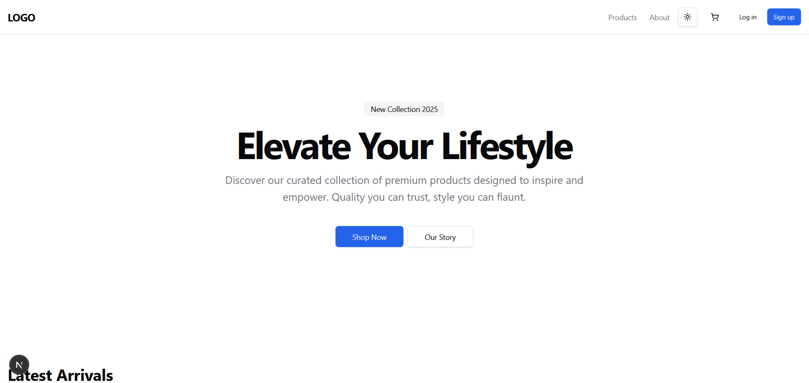

[//]: # ([README.md]&#40;README.md&#41;)
<!-- Improved compatibility of back to top link: See: https://github.com/rayanthoney/ram_uber_app/pull/73 -->

<a id="readme-top"></a>

<!-- WELCOME -->

<div align="center">
   <a href="-URL TO DEMO GOES HERE-">
    
  </a>

<h2 align="center">E Commerce Store Prototype 👋</h2>

   <p align="center">
    <h3>This document serves as a master template for building scalable, production-ready e-commerce applications.</h3>
    <br />
    <a href="https://github.com/-URL TO DEMO GOES HERE-.git"><strong>Explore the docs »</strong></a>
    <br />
    <br />
    <a href="https://github.com/rayanthoney/Repository-Name">View Demo</a>
    &middot;
    <a href="https://https://github.com/-URL TO DEMO GOES HERE-/issues/new?labels=bug&template=bug-report---.md">Report Bug</a>
    &middot;
    <a href="https://https://github.com/-URL TO DEMO GOES HERE-.git/issues/new?labels=enhancement&template=feature-request---.md">Request Feature</a>
  </p>
</div>

<!-- ABOUT THE PROJECT -->
# About The Project

<div align="center" >
<!-- link to project -->
    <a href='-URL TO DEMO GOES HERE-'>
    <!-- link to local image -->
        
    </a>
</div>

<br>

<!-- BUILT WITH -->
## Built With

### Tech Stack

This template enforces a Modular Monolith architecture using the following high-performance stack.


<!-- This is a [Next.js](https://nextjs.org) project bootstrapped with [`create-next-app`](https://nextjs.org/docs/app/api-reference/cli/create-next-app).

## Getting Started

First, run the development server:

```bash
npm run dev
# or
yarn dev
# or
pnpm dev
# or
bun dev
```

Open [http://localhost:3000](http://localhost:3000) with your browser to see the result.

You can start editing the page by modifying `app/page.tsx`. The page auto-updates as you edit the file.

This project uses [`next/font`](https://nextjs.org/docs/app/building-your-application/optimizing/fonts) to automatically optimize and load [Geist](https://vercel.com/font), a new font family for Vercel.

## Learn More

To learn more about Next.js, take a look at the following resources:

- [Next.js Documentation](https://nextjs.org/docs) - learn about Next.js features and API.
- [Learn Next.js](https://nextjs.org/learn) - an interactive Next.js tutorial.

You can check out [the Next.js GitHub repository](https://github.com/vercel/next.js) - your feedback and contributions are welcome!

## Deploy on Vercel

The easiest way to deploy your Next.js app is to use the [Vercel Platform](https://vercel.com/new?utm_medium=default-template&filter=next.js&utm_source=create-next-app&utm_campaign=create-next-app-readme) from the creators of Next.js.

Check out our [Next.js deployment documentation](https://nextjs.org/docs/app/building-your-application/deploying) for more details. -->
---


